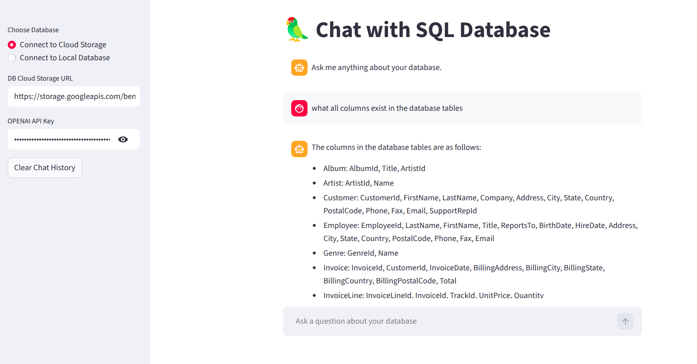

# 🦜 Chat with SQL Database

A **Streamlit-powered AI application** that allows you to **chat with your SQL database using natural language**.
Instead of writing SQL queries manually, you can simply ask questions like:

> *“Show the top 5 tracks by sales.”*
> *“List all customers from Germany.”*
> *“Which artist has the most albums?”*

The app converts your question into SQL using an LLM and returns the results instantly.

---

## 📸 UI Preview



## ✨ Features

🚀 **Natural Language → SQL**
Ask questions in plain English and get results from your database.

🗄 **Multiple Database Support**

* Cloud SQLite database
* Local MySQL database

🤖 **Powered by AI**

* Uses **LangChain** + **OpenAI GPT-4o** for intelligent SQL generation.

📊 **Interactive UI**

* Built with **Streamlit** for an intuitive chat interface.

🔍 **Automatic Schema Understanding**

* The model analyzes database tables and generates correct SQL queries.

---

## 🏗 Architecture

The app follows a clean pipeline architecture:

```
User Question
      ↓
LLM generates SQL query
      ↓
SQL query executed on database
      ↓
Results returned to the user
```

This avoids common SQL-agent issues like:

* parsing errors
* infinite loops
* markdown formatting problems

---

## 🛠 Tech Stack

* 🧠 **LangChain**
* 🤖 **OpenAI GPT-4o**
* 🌐 **Streamlit**
* 🗄 **SQLite / MySQL**
* 🐍 **Python**

---

## 📂 Project Structure

```
Chat_SQL
│
├── app.py                # Main Streamlit application
├── requirements.txt      # Python dependencies
├── README.md             # Project documentation
```

---

## ⚙️ Installation

### 1️⃣ Clone the repository

```bash
git clone https://github.com/siddhartharishi/Chat_SQL.git
cd Chat_SQL
```

---

### 2️⃣ Create a virtual environment

```bash
python -m venv venv
source venv/bin/activate
```

Windows:

```bash
venv\Scripts\activate
```

---

### 3️⃣ Install dependencies

```bash
pip install -r requirements.txt
```

---

## 🔑 Setup OpenAI API Key

Create an API key from
👉 https://platform.openai.com

Run the app and enter the key in the sidebar.

---

## ▶️ Run the Application

```bash
streamlit run app.py
```

Then open:

```
http://localhost:8501
```

---

## 💬 Example Queries

You can ask questions like:

```
Show the top 5 tracks by sales
List all customers from Canada
Which artist has the most albums
What are the most popular genres
```

---

## 🖥 Database Options

### Cloud SQLite Database

Provide a downloadable `.db` URL.

Example:

```
https://storage.googleapis.com/benchmarks-artifacts/chinook/Chinook.db
```

---

### Local MySQL Database

Enter:

* Host
* Username
* Password
* Database name

---


